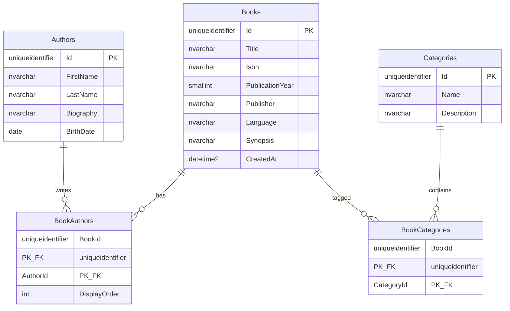

# Library Catalog ER Model

This document describes the SQL Server schema for the Library Catalog. Entity Framework Core maps this model in `sb.api.Library.Persistence` and reproduces it with migrations.

## Diagram



## Relationships

- A book has one or more authors (`BookAuthors`).
- An author can write many books.
- A book belongs to one or more categories (`BookCategories`).
- A category can contain many books.

Join tables are explicit so author display order and seed data stay first-class.

## Tables

### Authors

| Column | Type | Required | Notes |
| --- | --- | --- | --- |
| Id | UNIQUEIDENTIFIER | Yes | PK |
| FirstName | NVARCHAR(100) | Yes | |
| LastName | NVARCHAR(100) | Yes | |
| Biography | NVARCHAR(MAX) | No | |
| BirthDate | DATE | No | |

Index: non-unique on `LastName`.

### Categories

| Column | Type | Required | Notes |
| --- | --- | --- | --- |
| Id | UNIQUEIDENTIFIER | Yes | PK |
| Name | NVARCHAR(128) | Yes | Unique |
| Description | NVARCHAR(1024) | No | |

Index: unique on `Name`.

### Books

| Column | Type | Required | Notes |
| --- | --- | --- | --- |
| Id | UNIQUEIDENTIFIER | Yes | PK |
| Title | NVARCHAR(256) | Yes | |
| Isbn | NVARCHAR(17) | No | Unique when not null |
| PublicationYear | SMALLINT | No | |
| Publisher | NVARCHAR(256) | No | |
| Language | NVARCHAR(16) | No | |
| Synopsis | NVARCHAR(MAX) | No | |
| CreatedAt | DATETIME2 | Yes | UTC |

Indexes: non-unique on `Title`; unique filtered on `Isbn` where `Isbn IS NOT NULL`.

### BookAuthors

| Column | Type | Required | Notes |
| --- | --- | --- | --- |
| BookId | UNIQUEIDENTIFIER | Yes | PK, FK → Books.Id |
| AuthorId | UNIQUEIDENTIFIER | Yes | PK, FK → Authors.Id |
| DisplayOrder | INT | Yes | Order of authors on a book |

Referential integrity: `ON DELETE NO ACTION`.

### BookCategories

| Column | Type | Required | Notes |
| --- | --- | --- | --- |
| BookId | UNIQUEIDENTIFIER | Yes | PK, FK → Books.Id |
| CategoryId | UNIQUEIDENTIFIER | Yes | PK, FK → Categories.Id |

Referential integrity: `ON DELETE NO ACTION`.

## Reproduce the database

1. Set `ConnectionStrings:MyConnection` in `sb.api.Library/appsettings.json` to a local SQL Server instance (default: LocalDB `MSSQLLocalDB`).
2. Run the `sb.api.Library` host. Startup applies EF migrations and idempotent seeders.

## Verify in SSMS

```sql
USE LibraryCatalogDb;
GO

SELECT Id, FirstName, LastName, BirthDate FROM Authors;
SELECT Id, Name FROM Categories;
SELECT Id, Title, Isbn, PublicationYear, Publisher FROM Books;

-- Books with multiple authors
SELECT b.Title, a.FirstName, a.LastName, ba.DisplayOrder
FROM BookAuthors ba
INNER JOIN Books b ON b.Id = ba.BookId
INNER JOIN Authors a ON a.Id = ba.AuthorId
ORDER BY b.Title, ba.DisplayOrder;

-- Books with multiple categories
SELECT b.Title, c.Name
FROM BookCategories bc
INNER JOIN Books b ON b.Id = bc.BookId
INNER JOIN Categories c ON c.Id = bc.CategoryId
ORDER BY b.Title, c.Name;
```
